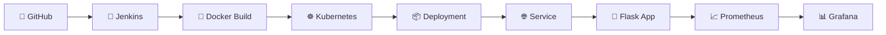
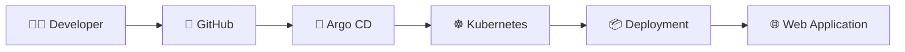
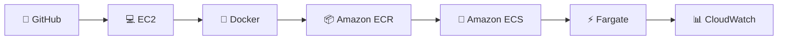
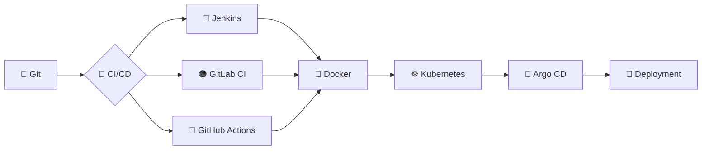
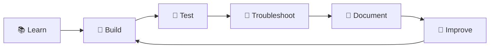

<div align="center">

# 👋 Hi, I'm **Vinay Sunhare**

### ☁️ DevOps & Cloud Engineer

**Building • Automating • Deploying • Monitoring**

<br>


<br>


<br><br>

<a href="https://github.com/vinaysunhare">

</a>

<a href="https://gitlab.com/vinaysunhare">

</a>

<a href="https://www.linkedin.com/in/vinay-sunhare/">

</a>

</div>

---

## 🧑‍💻 About Me

> **Aspiring DevOps & Cloud Engineer focused on hands-on learning, practical implementation and automation.**

I have **4+ years of professional experience as an SEO Executive** and have been building my DevOps & Cloud engineering skills through **2+ years of hands-on project-based learning and practical implementation**.

My current focus is on understanding and implementing:

```text
        💻 Source Code
              │
              ▼
          🔀 Git
              │
              ▼
       🔄 CI/CD Pipeline
              │
              ▼
        🐳 Docker
              │
        ┌─────┴─────┐
        ▼           ▼
   ☸️ Kubernetes   ☁️ AWS
        │           │
        └─────┬─────┘
              ▼
       📊 Monitoring
```

🎯 **Career Goal:** Move into a professional **DevOps / Cloud Engineering** role and continue growing through real-world infrastructure and automation work.

---

# 🧰 DevOps Toolkit

<div align="center">

# DevOps Toolkit

### Cloud & Infrastructure


### Containers & Orchestration


### CI/CD & GitOps


### Development & Automation


### Monitoring & Observability


**AWS CloudWatch**

### Infrastructure Automation


</div>

---

# 🚀 Featured Projects

> ⭐ **Projects below are based on my actual repositories and documented implementations.**

---

## 💰 01 • Indore Finance Service

### `🐍 Flask + 🐳 Docker + ☸️ Kubernetes + 🔄 Jenkins + 📊 Prometheus/Grafana`

A Flask-based application used to practice **containerization, Kubernetes deployment, CI/CD and monitoring**.

### 🛠️ Technology Stack

`Python` `Flask` `Docker` `Kubernetes` `Jenkins` `Prometheus` `Grafana`

### 🔧 What I Practiced

| 🔹 Area | 🧩 Implementation |
|---|---|
| 🐍 Application | Flask |
| 🐳 Container | Docker |
| ☸️ Orchestration | Kubernetes |
| 🔄 CI/CD | Jenkins |
| 📈 Monitoring | Prometheus |
| 📊 Visualization | Grafana |
| 🔐 Configuration | Kubernetes Secrets |
| 🌐 Networking | Kubernetes Service |

### 🔄 Architecture



### 📂 Repository

👉 **[View Indore Finance Service](https://github.com/vinaysunhare/indore-finance-service)**

---

# 🏗️ 02 • Terraform AWS Infrastructure

## `terraform`

A collection of hands-on **Terraform + AWS infrastructure projects** covering EC2, VPC, S3 and IAM.

### ☁️ AWS Technologies

`EC2` `VPC` `S3` `IAM` `Security Groups` `Terraform`

---

### 🔹 Project A — AWS VPC + EC2 + NGINX

**Focus:** AWS networking and EC2 provisioning using Terraform.

```text
🏗️ Terraform
      │
      ▼
☁️ AWS VPC
      │
 ┌────┴────┐
 ▼         ▼
🌐 Public   🔒 Private
Subnet     Subnet
 │
 ▼
💻 EC2
 │
 ▼
🌐 NGINX
```

**Practiced:**

- ☁️ VPC
- 🌐 Subnets
- 🌍 Internet Gateway
- 🛣️ Route Tables
- 🔐 Security Groups
- 💻 EC2
- 🌐 NGINX
- 📤 Terraform Outputs

👉 [View AWS VPC + EC2 + NGINX](https://github.com/vinaysunhare/terraform/blob/main/project-aws-vpc-ec2-nginx.md)

---

### 🔹 Project B — AWS IAM User Management

Terraform-based IAM user management using YAML configuration.

**Practiced:**

- 👤 IAM Users
- 🔑 IAM Policies
- 🛡️ IAM Roles
- 📄 YAML configuration
- 🔁 `for_each`
- 🧩 `locals`
- 📝 `yamldecode()`

👉 [View IAM User Management](https://github.com/vinaysunhare/terraform/blob/main/project-iam-user-management.md)

---

### 🔹 Project C — Terraform AWS S3 Restaurant Website

AWS S3 static website project using Terraform.

**Practiced:**

- 🪣 S3 Bucket
- 🌐 Static Website Hosting
- 🔐 Bucket Policy
- 📄 Website Files
- 🏗️ Terraform Resources

👉 [View S3 Restaurant Website](https://github.com/vinaysunhare/terraform/blob/main/project-terraform-aws-s3-restaurant-website.md)

---

### 🔹 Project D — EC2 Instance with Terraform

Terraform-based EC2 provisioning.

**Practiced:**

- ☁️ AWS Provider
- 💻 EC2
- 🖥️ AMI
- 🌎 AWS Region
- ⚙️ Terraform Resources

👉 [View EC2 Terraform Project](https://github.com/vinaysunhare/terraform/blob/main/ec2-instance-with-tf.md)

---

### 🔹 Project E — S3 Bucket with Terraform

Basic AWS S3 provisioning using Terraform.

**Practiced:**

```text
terraform init
      ↓
terraform validate
      ↓
terraform plan
      ↓
terraform apply
      ↓
☁️ AWS S3
      ↓
terraform destroy
```

👉 [View S3 Terraform Guide](https://github.com/vinaysunhare/terraform/blob/main/s3-bucket-with-terraform.md)

### 📂 Main Repository

👉 **[View Terraform Repository](https://github.com/vinaysunhare/terraform)**

---

# 🔄 03 • GitOps with Argo CD

### `🐳 Docker + ☸️ Kubernetes + 🔄 Argo CD`

A hands-on GitOps project using GitHub, Docker, Kubernetes and Argo CD.

### 🛠️ Stack

`Docker` `Kubernetes` `Minikube` `Kind` `Argo CD` `GitHub`

### 📦 Repository Components

```text
📁 gitops-with-argo-cd
│
├── 🐳 Dockerfile
├── 🌐 index.html
├── 🎨 styles.css
├── ☸️ k8s-web-deploy.yaml
└── 🔄 manufacturing-site-app.yaml
```

### 🔄 GitOps Workflow



### 🔧 What I Practiced

- 🐳 Docker image creation
- ☸️ Kubernetes Deployment
- 🌐 Kubernetes Service
- 🔄 Argo CD Application
- 🔀 GitHub integration
- 🔁 Automated synchronization
- 📦 Kubernetes manifests
- 🛠️ Troubleshooting

👉 **[View GitOps with Argo CD](https://github.com/vinaysunhare/gitops-with-argo-cd)**

---

# 🚢 04 • CI/CD Demo App — AWS Container Deployment

### `🐍 FastAPI + 🐳 Docker + ☁️ ECR + 🚢 ECS/Fargate`

A practical project for learning **container deployment on AWS**.

### 🔄 Deployment Flow



### 🧩 Practical Work

- 💻 Ubuntu/EC2 environment
- 🐳 Docker installation
- 🔐 Docker permissions
- ☁️ AWS CLI
- 📦 ECR authentication
- 🐳 Image build/tagging
- 📦 ECR repository
- 🚢 ECS/Fargate deployment
- 📊 CloudWatch

👉 **[View CICD Demo App](https://github.com/vinaysunhare/cicd-demo-app-project)**

---

# ⚙️ 05 • Ansible + Docker Automation

### `⚙️ Ansible + 🐳 Docker + 🔄 GitHub Actions`

Hands-on automation project combining application components, Docker and monitoring.

### 🛠️ Stack

`Ansible` `Docker` `GitHub Actions` `Flask` `React` `PostgreSQL` `Prometheus` `Grafana`

### 🔧 Areas

- ⚙️ Ansible automation
- 🐳 Docker
- 🔄 GitHub Actions
- 🐍 Flask
- ⚛️ React
- 🐘 PostgreSQL
- 📈 Prometheus
- 📊 Grafana

👉 **[View Ansible Docker Project](https://github.com/vinaysunhare/ansible-docker-project)**

---

# 🐳 06 • Dockerized Rails Application

### `💎 Ruby on Rails + 🐳 Docker + 🐘 PostgreSQL`

A containerization project involving a Rails application and PostgreSQL.

### 🧩 Practiced

- 🐳 Docker image creation
- 📦 Application containerization
- 🐘 PostgreSQL container
- 🔗 Application/database connectivity
- 🛠️ Docker environment setup

👉 **[View Rails + PostgreSQL Project](https://github.com/vinaysunhare/Dockerized-Rails-app-with-PostgreSQL)**

---

# 🔐 07 • Secure Bank Application

### `🔒 Application + Security`

A project included in my application development and security-focused learning.

### 🎯 Focus

`🔐 Security` `💻 Application` `⚙️ Configuration` `🛠️ Troubleshooting`

👉 **[View Secure Bank App](https://github.com/vinaysunhare/secure-bank-app)**

---

# 🎬 08 • Sunhare Movies ERA

### `🎥 Movie Streaming / Discovery Platform`

A movie-focused platform designed around browsing and discovering movies.

### ✨ Features

| 🎯 Feature | Description |
|---|---|
| 🎬 Movies | Movie browsing |
| 🗂️ Genre | Genre-based categorization |
| 📅 Year | Year-based discovery |
| 🔎 Search | Movie search |
| 🤖 Recommendations | Personalized recommendations |
| 📱 Interface | Interactive experience |

### 🔄 Concept

```text
                 👤 User
                    │
                    ▼
            🎬 Sunhare Movies ERA
                    │
       ┌────────────┼────────────┐
       ▼            ▼            ▼
    🔎 Search     🗂️ Genre      📅 Year
       │            │            │
       └────────────┼────────────┘
                    ▼
             🤖 Recommendations
                    │
                    ▼
             🎬 Movie Discovery
```

👉 **[View GitLab Repository](https://gitlab.com/vinaysunhare/streaming_platform)**

---

# 🟢 09 • Basic Application

### `basic-app`

A basic application repository used for development and containerization practice.

**Focus:** `🟢 Application` `🐳 Docker` `🛠️ Development`

👉 **[View Basic App](https://github.com/vinaysunhare/basic-app)**

---

# 📊 Project & Skill Matrix

<div align="center">

| 🚀 Project | ☁️ AWS | 🐳 Docker | ☸️ K8s | 🔄 CI/CD | 🏗️ IaC | 📊 Monitoring |
|:---|:---:|:---:|:---:|:---:|:---:|:---:|
| 💰 Indore Finance | — | ✅ | ✅ | ✅ | — | ✅ |
| 🏗️ Terraform AWS | ✅ | — | — | — | ✅ | — |
| 🔄 GitOps Argo CD | — | ✅ | ✅ | ✅ | — | — |
| 🚢 CICD Demo App | ✅ | ✅ | — | 🔄 | — | ✅ |
| ⚙️ Ansible Docker | — | ✅ | — | ✅ | ⚙️ | ✅ |
| 🐳 Rails + PostgreSQL | — | ✅ | — | — | — | — |
| 🔐 Secure Bank | — | — | — | — | — | — |
| 🎬 Movies ERA | — | — | — | — | — | — |
| 🟢 Basic App | — | 🔄 | — | — | — | — |

</div>

---

# ☁️ AWS Skills

<div align="center">

| ☁️ Service | 🧩 Practical Area |
|:---|:---|
| 🖥️ **EC2** | Linux server & application environment |
| 🪣 **S3** | Object storage & static website |
| 🌐 **VPC** | Networking |
| 🔐 **IAM** | Users, roles & permissions |
| 📦 **ECR** | Container image registry |
| 🚢 **ECS** | Container deployment |
| ⚡ **Fargate** | Serverless containers |
| 📊 **CloudWatch** | Logs & monitoring |
| 💾 **EBS** | EC2 storage |
| ⚖️ **ALB** | Load balancing concepts |
| λ **Lambda** | Serverless learning |

</div>

---

# 🔄 CI/CD & GitOps



---

# 📊 Monitoring & Observability

### 📈 Prometheus + Grafana

Used in project work involving application metrics and monitoring.

```text
🐍 Application
      │
      ▼
📈 /metrics
      │
      ▼
📊 Prometheus
      │
      ▼
📉 Grafana
      │
      ▼
📊 Dashboard
```

### ☁️ AWS CloudWatch

```text
☁️ AWS Workload
      │
      ▼
📊 CloudWatch
   ┌──┴──┐
   ▼     ▼
 📜 Logs  📈 Metrics
```

---

# 🏗️ Infrastructure as Code

### Terraform

```text
📝 Terraform Code
       │
       ▼
🔍 Validate
       │
       ▼
📋 Plan
       │
       ▼
🚀 Apply
       │
       ▼
☁️ AWS Infrastructure
       │
       ▼
🗑️ Destroy
```

Practical areas include:

`VPC` `EC2` `S3` `IAM` `Subnets` `Route Tables` `Security Groups` `Terraform Backend` `Variables` `Outputs`

### Ansible

`⚙️ Automation` `🐳 Docker Configuration` `🔄 Repetitive Tasks`

---

# 🔐 DevSecOps — Current Learning

I am currently expanding my understanding of:

```text
🔀 Git
 │
 ▼
🔄 CI/CD
 │
 ├── 🔍 SonarQube
 ├── 🛡️ Trivy
 └── 🔐 Gitleaks
 │
 ▼
🐳 Container
 │
 ▼
☁️ Deployment
```

> These are part of my current learning and project practice and are **not represented as professional production experience**.

---

# 🐧 Linux Practice

### 💻 Areas I Practice

`📁 File System`  
`👤 Users & Groups`  
`🔐 Permissions`  
`🔑 SSH`  
`⚙️ Processes`  
`🌐 Networking`  
`🔌 Ports`  
`📦 Package Management`  
`📜 Logs`  
`🐳 Docker Permissions`  
`🛠️ Troubleshooting`

---

# 📚 Education & Learning

### 🎓 MCA

**Chandigarh University — Online**  
Currently Pursuing

### 🎓 MBA

**Oriental University, Indore**

### 🎓 BBA

**Vikram University, Ujjain**

### ☁️ AWS

**AWS Cloud Practitioner Essentials**

---

# 💼 Professional Background

### 🏢 SEO Executive — Cyber Infrastructure

**April 2022 – Present**

My professional background includes:

`🔍 Technical SEO`  
`📄 On-Page SEO`  
`🔎 Keyword Research`  
`🛠️ SEO Audits`  
`⚡ Website Performance`  
`📊 Analytics & Reporting`

Alongside my professional career, I have been building my **DevOps & Cloud engineering skills through hands-on projects and practical implementation**.

---

# 🎯 Career Direction

### 🚀 Looking to Start My Professional DevOps Journey

I'm interested in:

**☁️ Junior DevOps Engineer**  
**☁️ Cloud Engineer**  
**🔄 DevOps Trainee**  
**🛠️ DevOps Internship**  
**☁️ Cloud / Infrastructure Internship**

My goal is to move from project-based learning into a **real engineering environment**, learn from experienced engineers and contribute to infrastructure, automation and deployment tasks.

---

# 🧠 My Learning Philosophy



### **Learn → Build → Troubleshoot → Document → Improve**

---

# 📂 Quick Repository Guide

| 📁 Repository | 🎯 Main Focus |
|---|---|
| 💰 [Indore Finance Service](https://github.com/vinaysunhare/indore-finance-service) | Docker • Kubernetes • Jenkins • Prometheus • Grafana |
| 🏗️ [Terraform](https://github.com/vinaysunhare/terraform) | Terraform • AWS • EC2 • VPC • S3 • IAM |
| 🔄 [GitOps with Argo CD](https://github.com/vinaysunhare/gitops-with-argo-cd) | Docker • Kubernetes • Argo CD |
| 🚢 [CICD Demo App](https://github.com/vinaysunhare/cicd-demo-app-project) | Docker • ECR • ECS • Fargate |
| ⚙️ [Ansible Docker](https://github.com/vinaysunhare/ansible-docker-project) | Ansible • Docker • GitHub Actions |
| 🐳 [Rails PostgreSQL](https://github.com/vinaysunhare/Dockerized-Rails-app-with-PostgreSQL) | Docker • Rails • PostgreSQL |
| 🔐 [Secure Bank](https://github.com/vinaysunhare/secure-bank-app) | Application • Security |
| 🎬 [Sunhare Movies ERA](https://gitlab.com/vinaysunhare/streaming_platform) | Movie Streaming / Discovery |
| 🟢 [Basic App](https://github.com/vinaysunhare/basic-app) | Application / Docker Practice |

---

# 📊 GitHub

<div align="center">


<br>


<br>


</div>

---

# 🤝 Connect With Me

<div align="center">

<a href="https://github.com/vinaysunhare">

</a>

<a href="https://gitlab.com/vinaysunhare">

</a>

<a href="https://www.linkedin.com/in/vinay-sunhare/">

</a>

</div>

---

<div align="center">

### 🚀 **Learn • Build • Troubleshoot • Automate • Improve**

⭐ **Thanks for visiting my profile!**

</div>
